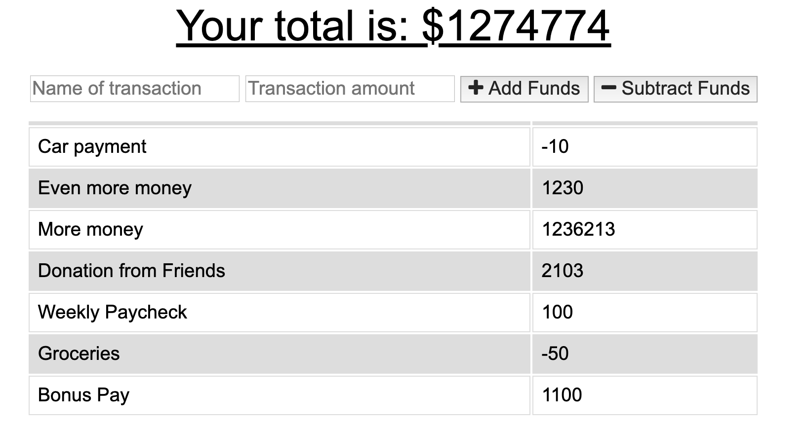
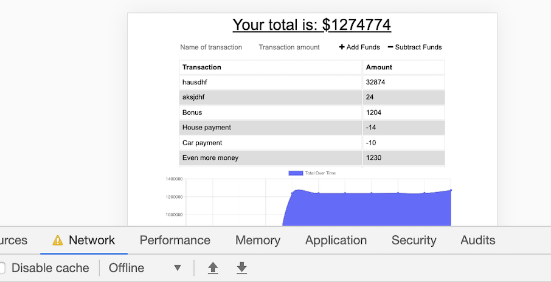

# OfflineBudgetTracker

The Offline Budget Tracker is an app that allows users to enter expenses/additions to their accounts while online and offline. 

Technologies Utilized: Webpack, Node, Express, JavaScript, jQuery, MongoDB, IndexedDB, Heroku

Deployed Link: https://still-bayou-97807.herokuapp.com/

Screenshots:

